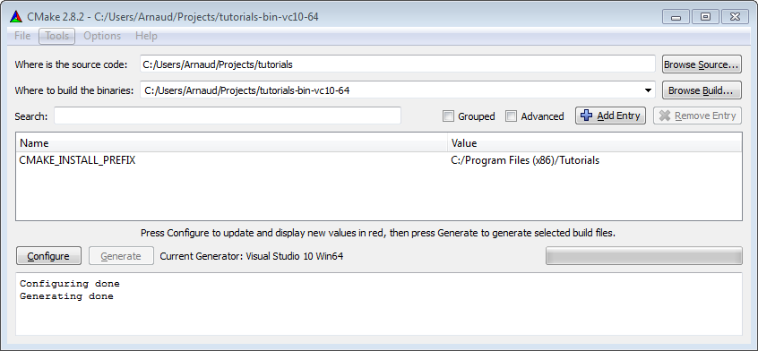
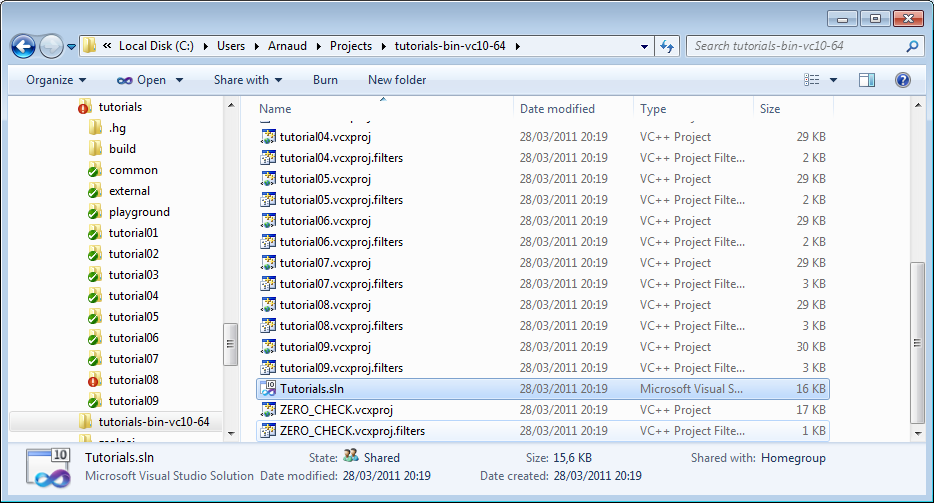
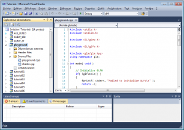
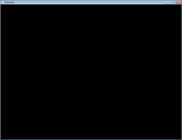
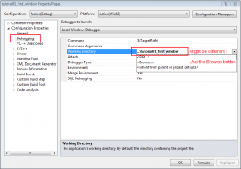
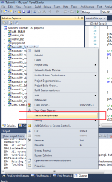
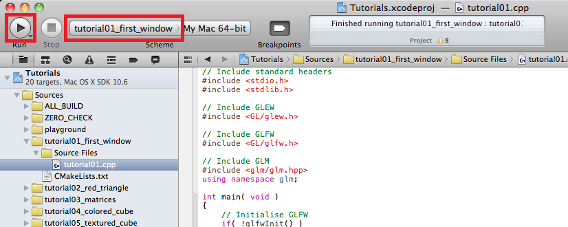
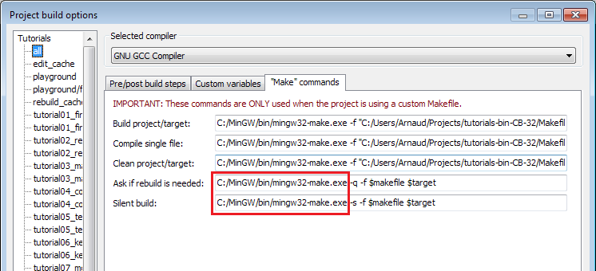

## 简介

欢迎来到第一课！

在学习 OpenGL 之前，我们将先学习如何生成，运行，和玩转（最重要的一点）课程中的代
码。

### 预备知识

不需要特别的预备知识。如果你有 C、Java、Lisp、Javascript 等编程语言的经验，那么
理解课程代码会更快；但这不是必需的；如果没有，那么也仅仅是同时学两样东西（编程语
言+OpenGL）会稍微复杂点而已。

课程全部用“傻瓜式 C++”编写：我费了很大劲尽量让代码简单些。代码里没有模板
（template）、类或指针。就是说，即使只懂 Java，也能理解所有内容。

### 忘记一切

如前面所说，我们不需要预备知识；但请暂时把『老式 OpenGL』先忘了吧（例如
glBegin()这类东西）。在这里，你将学习新式 OpenGL（OpenGL 3 和 4），而多数网上教
程还在讲『老式 OpenGL』（OpenGL 1 和 2）。所以，在你的脑袋乱成一锅粥之前，把它们
都搁在一边吧。

### 生成课程中的代码

所有课程代码都能在 Windows、Linux、和 Mac 上生成，而且过程大体相同：

- 更新驱动
- 下载 C++编译器。
- 安装 CMake
- 下载全部课程代码
- 用 CMake 创建工程
- 编译工程
- 试试这些例子！

各平台的详细代码生成过程将会在后面一一给出，不过具体每个平台可能会有差异。如果你
不确定，可以去看看 [Windows 平台的生成说明]()，然后按照需改动一下来适应你自己的
平台。

### 在 Windows 平台上生成代码

1. 更新驱动应该很轻松。直接去 NVIDIA 或者 AMD 的官网下载。若不清楚 GPU 的型号:控
   制面板->系统和安全->系统->设备管理器->显示适配器。如果是 Intel 集成显卡，一般
   由电脑厂商（Dell、HP 等）提供驱动。

2. 建议用 Visual Studio Express 来编译。 这里可以免费下载。 若喜欢用 MinGW，推
   荐[Qt Creator](http://qt-project.org/)。安装哪个都行。下列步骤是用 Visual
   Studio 讲解的，其他 IDE 也差不多。

3. 从这里下载安装 [CMake](http://www.cmake.org/cmake/resources/software.html) 。

4. [下载课程源码](http://www.opengl-tutorial.org/?page_id=200) ，解压到例如
   C:/Users/XYZ/Projects/OpenGLTutorials .

5. 启动 CMake。让第一栏路径指向刚才解压缩的文件夹；若不确定，就选包含
   CMakeLists.txt 的文件夹。第二栏，填 CMake 输出路径 （译者注：这里 CMake 输出
   一个可以在 Visual Studio 中打开和编译的工程）。例如
   C:/Users/XYZ/Projects/OpenGLTutorials-build-Visual2010-32bits，或者
   C:/Users/XYZ/Projects/OpenGLTutorials/build/Visual2010-32bits。注意，此处可随
   便填，不一定要和源码在同一文件夹。

   

6. 点击 Configure。由于是首次 configure 工程，CMake 会让你选择编译器。根据步骤 1
   选择。如果你的 Windows 是 64 位的，选 64 位。不清楚就选 32 位。\

7. 再点 Configure 直至红色行全部消失。点 Generate。Visual Studio 工程创建完毕
   。Visual Studio 工程创建完毕。不再需要 CMake 了，可以卸载掉。

8. 打开 C:/Users/XYZ/Projects/OpenGL/Tutorials-build-Visual2010-32bits 会看到
   Tutorials.sln 文件（译者注：这就是 CMake 生成的 VS 项目文件），用 Visual
   Studio 打开它。

   

   在 Build 菜单中，点 Build All。每个课程代码和依赖项都会被编译。生成的可执行文
   件会出现在 C:/Users/XYZ/Projects/OpenGLTutorials。但愿不会报错。

   

9. 打开 C:/Users/XYZ/Projects/OpenGLTutorials/playground，运行 playground.exe，
   会弹出一个黑色窗口。

   

   也可以在 Visual Studio 中运行任意一课的代码，但得先设置工作目录：右键点击
   Playground，选择 Debugging、Working Directory、Browse，设置路径为
   C:/Users/XYZ/Projects/OpenGLTutorials/playground。验证一下。再次右键点击
   Playground，“Choose as startup project”。按 F5 就可以调试了。

   

   

### 在 Linux 上生成

Linux 版本众多，这里不可能列出所有的平台。按需变通一下吧，也不妨看一下发行版文档
。

1. 安装最新驱动。强烈推荐闭源的二进制驱动；它们不开源，但好用。如果发行版不提供
   自动安装，试
   试[Ubuntu 指南](http://help.ubuntu.com/community/BinaryDriverHowto).

2. 安装全部需要的编译器、工具和库。完整清单如下：cmake make g++ libx11-dev
   libgl1-mesa-dev libglu1-mesa-dev libxrandr-dev libxext-dev 。 用 sudo apt-get
   install **\*** 或者 su && yum install **\*\***。

3. [下载课程源码](http://www.opengl-tutorial.org/?page_id=200) 并解压到如
   ~/Projects/OpenGLTutorials/

4. 接着输入如下命令 :

   ```
   cd ~/Projects/OpenGLTutorials/
   mkdir build
   cd build
   cmake ..
   ```

5. build/目录会创建一个 makefile 文件。

6. 键入“make all”。每个课程代码和依赖项都会被编译。生成的可执行文件在
   ~/Projects/OpenGLTutorials/。但愿不会报错。

7. 打开~/Projects/OpenGLTutorials/playground，运行./playground 会弹出一个黑色窗
   口。

提示：推荐使用[Qt Creator](http://qt-project.org/)作为 IDE。值得一提的是，Qt
Creator 内置支持 CMake，调试起来也顺手。如下是 QtCreator 使用说明：

1.在 QtCreator 中打开 Tools->Options->Compile-&Execute->CMake

2.设置 CMake 路径。很可能像这样/usr/bin/cmake

3.File->Open Project；选择 tutorials/CMakeLists.txt

4.选择生成目录，最好选择 tutorials 文件夹外面

5.还可以在参数栏中设置-DCMAKE_BUILD_TYPE=Debug。验证一下。

6.点击下面的锤子图标。现在教程可以从 tutorials/文件夹启动了。

7.要想在 QtCreator 中运行教程源码，点击 Projects->Execution parameters->Working
Directory，选择着色器、纹理和模型所在目录。以第二课为例
：~/opengl-tutorial/tutorial02_red_triangle/

### 在 Mac 上生成

Mac OS 不支持 OpenGL 3.3。最近，搭载 MacOS 10.7 Lion 和兼容型 GPU 的 Mac 电脑可
以跑 OpenGL 3.2 了，但 3.3 还不行；所以我们用 2.1 移植版的课程代码。除此外，其他
步骤和 Windows 类似（也支持 Makefiles，此处不赘述）：

1.从 Mac App Store 安装 XCode

2.下载[CMake](http://www.cmake.org/cmake/resources/software.html)，安装.dmg。无
需安装命令行工具。

3.下载[课程源码](http://www.opengl-tutorial.org/?page_id=200) （2.1 版！！）解压
到如~/Projects/OpenGLTutorials/ .

4.启动 CMake （Applications->CMake）。让第一栏路径指向刚才解压缩的文件夹，不确定
就选包含 CMakeLists.txt 的文件夹。第二栏，填 CMake 输出路径。例如
~/Projects/OpenGLTutorials_bin_XCode/。注意，这里可以随便填，不一定要和源码在同
一文件夹。

5.点击 Configure。由于是首次 configure 工程，CMake 会让你选择编译器。选择
Xcode。

6.再点 Configure 直至红色行全部消失。点 Generate。Xcode 项目创建完毕。不再需要
CMake 了，可以卸载掉。

7.打开~/Projects/OpenGLTutorials_bin_XCode/会看到 Tutorials.xcodeproj 文件：打开
它。

8.选择一个教程，在 Xcode 的 Scheme 面板上运行，点击 Run 按钮编译和运行：



**在第二课及后续课程中，Run 按钮就失效了。下一版本会解决这个 bug。目前，请用
Cmd-B 键运行（双击源码文件夹/tutorialX/tutorialX，或者通过终端）。**

##关于 Code::Blocks 的说明由于 C::B 和 CMake 中各有一个 bug，你得在
Project->Build->Options->Make commands 中手动设置编译命令，如下图所示：



同时你还得手动设置工作目录：Project->Properties->Build targets->tutorial
N->execution working dir（即 src_dir/tutorial_N/）。

##运行课程例子一定要在正确的目录下运行课程例子：你可以双击可执行文件；如果爱用命
令行，请用 cd 命令切换到正确的目录。

若想从 IDE 中运行程序，别忘了看看上面的说明——先正确设置工作目录。

##如何学习本课程每课都附有源码和数据，可在 tutorialXX/找到。不过，建议您不改动这
些工程，将它们作为参考；推荐在 playground/playground.cpp 中做试验，怎么折腾都行
。要是弄乱了，就去粘一段课程代码，一切就会恢复正常。

我们会在整个教程中提供代码片段。不妨在看教程时，直接把它们复制到 playground 里跑
跑看。动手实验才是王道。单纯看别人写好的代码学不了多少。即使仅仅粘贴一下代码，也
会碰到不少问题。

##新建一个窗口终于！写 OpenGL 代码的时刻来了！

呃，其实还早着呢。有的教程都会教你以“底层”的方式做事，好让你清楚每一步的原理。但
这往往很无聊也无用。所以，我们用一个外部的库——GLFW 来帮我们处理窗口、键盘消息等
细节。你也可以使用 Windows 的 Win32 API、Linux 的 X11 API，或 Mac 的 Cocoa API；
或者用别的库，比如 SFML、FreeGLUT、SDL 等，请参见链接页。

我们开始吧。从处理依赖库开始：我们要用一些基本库，在控制台显示消息：

```
// Include standard headers
#include <stdio.h>
#include <stdlib.h>
```

然后是 GLEW 库。这东西的原理，我们以后再说。

```
// Include GLEW. Always include it before gl.h and glfw.h, since it's a bit magic.
#include <GL/glew.h>
```

我们使用 GLFW 库处理窗口和键盘消息，把它也包含进来：

```
// Include GLFW
#include <GL/glfw.h>
```

下面的 GLM 是个很有用的三维数学库，我们暂时没用到，但很快就会用上。GLM 库很好用
，但没有什么神奇的，你自己也可以写一个。添加“using namespace”是为了不用写
“glm::vec3”，直接写“vec3”。

```
// Include GLM
#include <glm/glm.hpp>
using namespace glm;
```

如果把这些#include 都粘贴到 playground.cpp，编译器会报错，说缺少 main 函数。所以
我们创建一个 ：

```
int main(){
```

首先初始化 GLFW ：

```
// Initialise GLFW
if( !glfwInit() )
{
    fprintf( stderr, "Failed to initialize GLFW\n" );
    return -1;
}
```

可以创建我们的第一个 OpenGL 窗口啦！

```
glfwOpenWindowHint(GLFW_FSAA_SAMPLES, 4); // 4x antialiasing
glfwOpenWindowHint(GLFW_OPENGL_VERSION_MAJOR, 3); // We want OpenGL 3.3
glfwOpenWindowHint(GLFW_OPENGL_VERSION_MINOR, 3);
glfwOpenWindowHint(GLFW_OPENGL_PROFILE, GLFW_OPENGL_CORE_PROFILE); //We don't want the old OpenGL

// Open a window and create its OpenGL context
if( !glfwOpenWindow( 1024, 768, 0,0,0,0, 32,0, GLFW_WINDOW ) )
{
    fprintf( stderr, "Failed to open GLFW window\n" );
    glfwTerminate();
    return -1;
}

// Initialize GLEW
glewExperimental=true; // Needed in core profile
if (glewInit() != GLEW_OK) {
    fprintf(stderr, "Failed to initialize GLEW\n");
    return -1;
}

glfwSetWindowTitle( "Tutorial 01" );
```

编译并运行。一个窗口弹出后立即关闭了。可不是嘛！还没设置等待用户 Esc 按键再关闭
呢：

```
// Ensure we can capture the escape key being pressed below
glfwEnable( GLFW_STICKY_KEYS );

do{
    // Draw nothing, see you in tutorial 2 !

    // Swap buffers
    glfwSwapBuffers();

} // Check if the ESC key was pressed or the window was closed
while( glfwGetKey( GLFW_KEY_ESC ) != GLFW_PRESS &&
glfwGetWindowParam( GLFW_OPENED ) );
```
