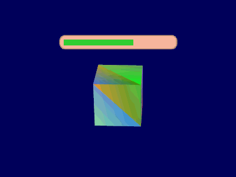
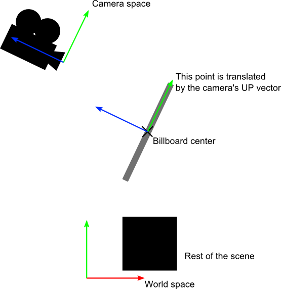
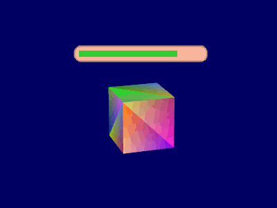
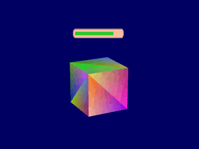
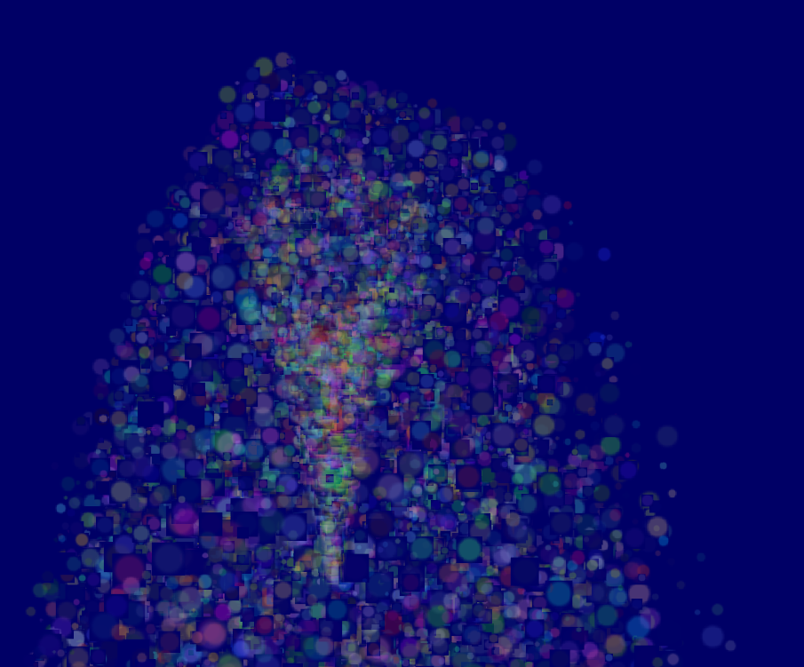
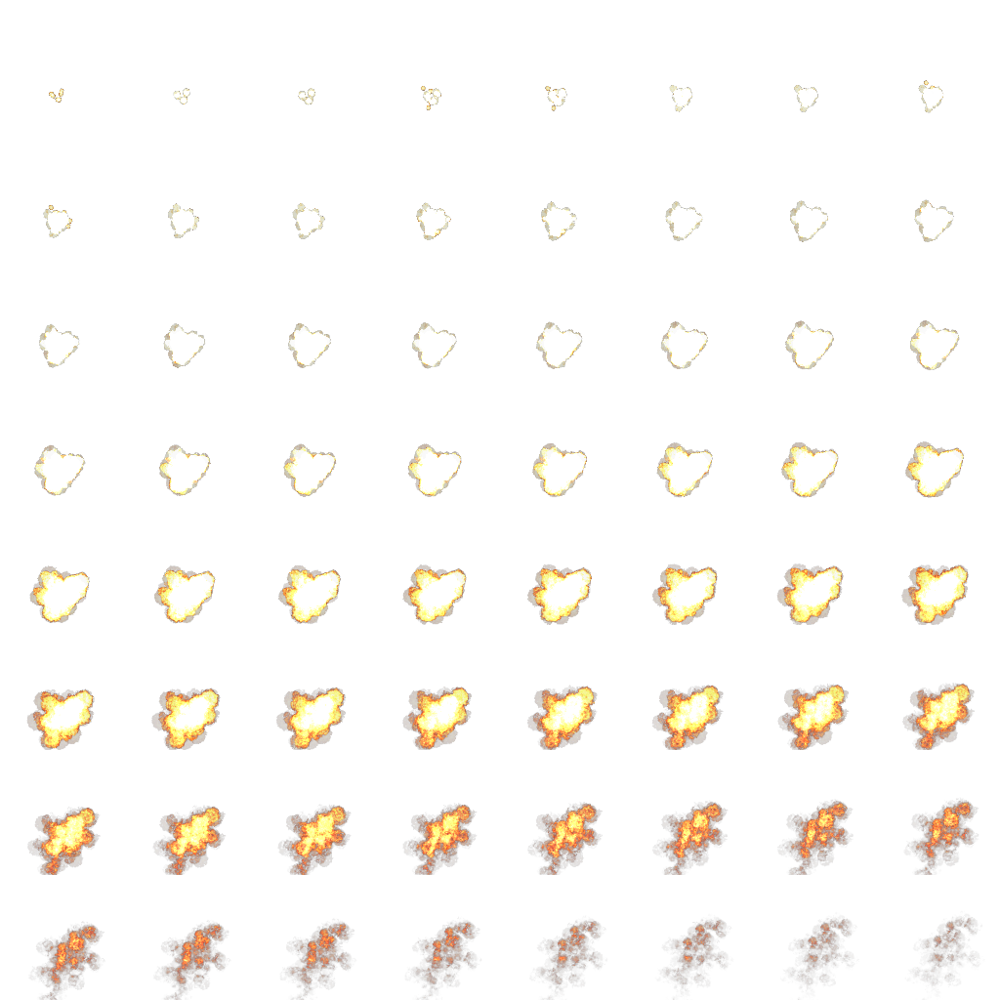
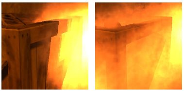
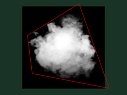

## Billbard 和粒子

公告板是 3D 世界中的 2D 元素。它既不是最顶层的 2D 菜单，也不是可以随意转动的 3D
平面，而是介于两者之间的一种元素，比如游戏中的血条。

公告板的独特之处在于：它位于某个特定位置，朝向是自动计算的，这样它就能始终面向相
机（观察者）。

## 方案 1:2D 法

2D 法十分简单。只需计算出点在屏幕空间的坐标，然后在该处显示 2D 文本（参见第十一
课）即可。

```cpp
// Everything here is explained in Tutorial 3 ! There's nothing new.
glm::vec4 BillboardPos_worldspace(x,y,z, 1.0f);
glm::vec4 BillboardPos_screenspace = ProjectionMatrix * ViewMatrix * BillboardPos_worldspace;
BillboardPos_screenspace /= BillboardPos_screenspace.w;

if (BillboardPos_screenspace.z < 0.0f){
    // Object is behind the camera, don't display it.
}
```

就这么搞定了！

2D 法优点是简单易行，无论点与相机距离远近，公告板始终保持大小不变。但此法总是把
文本显示在最顶层，有可能会遮挡其他物体，影响渲染效果。

## 方案 2:3D 法

与 2D 法相比，3D 法常常效果更好，也没复杂多少。我们的目的就是无论相机如何移动，
都要让公告板网格正对着相机：



可将此视为模型矩阵的构造问题之简化版。基本思路是将公告板的各角落置于 （存疑待查
）The idea is that each corner of the billboard is at the center position,
displaced by the camera’s up and right vectors :



当然，我们仅仅知道世界空间中的公告板中心位置，因此还需要相机在世界空间中的
up/right 向量。

在相机空间，相机的 up 向量为(0,1,0)。要把 up 向量变换到世界空间，只需乘以观察矩
阵的逆矩阵（由相机空间变换至世界空间的矩阵）。

用数学公式表示即：

CameraRight_worldspace = {ViewMatrix[0][0], ViewMatrix[1][0], ViewMatrix[2][0]}
CameraUp_worldspace = {ViewMatrix[0][1], ViewMatrix[1][1], ViewMatrix[2][1]}

接下来，顶点坐标的计算就很简单了：

```glsl
vec3 vertexPosition_worldspace =
    particleCenter_wordspace
    + CameraRight_worldspace * squareVertices.x * BillboardSize.x
    + CameraUp_worldspace * squareVertices.y * BillboardSize.y;
```

- `particleCenter_worldspace`顾名思义即公告板的中心位置，以 vec3 类型的 uniform
  变量表示。
- `squareVertices`是原始的网格。左顶点的`squareVertices.x`为-0.5（存疑待查）
  ，which are thus moved towars the left of the camera (because of the
  \*CameraRight_worldspace)
- `BillboardSize`是公告板大小，以世界单位为单位，uniform 变量。

效果如下。怎么样，是不是很简单？



为了保证内容完整性，这里给出`squareVertices`的数据：

```cpp
// The VBO containing the 4 vertices of the particles.
 static const GLfloat g_vertex_buffer_data[] = {
 -0.5f, -0.5f, 0.0f,
 0.5f, -0.5f, 0.0f,
 -0.5f, 0.5f, 0.0f,
 0.5f, 0.5f, 0.0f,
 };
```

## 方案 3：固定大小 3D 法

正如上面所看到的，公告板大小随着相机与之的距离变化。有些情况下的确需要这样的效果
，但血条这类公告板则需要保持大小不变。

```cpp
vertexPosition_worldspace = particleCenter_wordspace;
// Get the screen-space position of the particle's center
gl_Position = VP * vec4(vertexPosition_worldspace, 1.0f);
// Here we have to do the perspective division ourselves.
gl_Position /= gl_Position.w;

// Move the vertex in directly screen space. No need for CameraUp/Right_worlspace here.
gl_Position.xy += squareVertices.xy * vec2(0.2, 0.05);
```



## 方案 4：限制垂直旋转法

一些引擎以公告板表示远处的树和灯。不过，这些树可不能任意转向，**必须**是竖直的
。So you need an hybrid system that rotates only around one axis.（存疑待查）

这个方案作为练习留给读者。

# 粒子（Particles）与实例（Instancing）

粒子与 3D 公告板很类似。不过，粒子有如下四个特点：

- 数量较大
- 可以运动
- 有生有死
- 半透明

伴随这些特点而来的是一系列问题。本课仅介绍**其中一种**解决方案，其他解决方案还多
着呢……

## 一大波粒子正在接近中……

首先想到的思路就是套用上一课的代码，调用`glDrawArrays`逐个绘制粒子。这可不是个好
办法。因为这种思路意味着你那锃光瓦亮的 GTX 512 显卡一次只能绘制**一个**四边形（
很明显，性能损失高达 99%）。就这么一个接一个地绘制公告板。

显然，我们得一次性绘制所有的粒子。

方法有很多种，如下是其中三种：

- 生成一个 VBO，将所有粒子置于其中。简单，有效，在各种平台上均可行。
- 使用 geometry shader。这不在本教程范围内，主要是因为 50%的机器不支持该特性。
- 使用实例（instancing）。大部分机器都支持该特性。

本课将采用第三种方法。这种方法兼具性能优势和普适性，更重要的是，如果此法行得通，
那第一种方法也就轻而易举了。

###实例### “实例”的意思是以一个网格（比如本课中由两个三角形组成的四边形）为蓝本
，创建多个该网格的实例。

具体地讲，我们通过如下一些 buffer 实现 instancing：

- 一部分用于描述原始网格
- 一部分用于描述各实例的特性

这些 buffer 的内容可自行选择。在我们这个简单的例子包含了：

- 一个网格顶点 buffer。没有 index buffer，因此一共有 6 个`vec3`变量，构成两个三
  角形，进而组合成一个四边形。
- 一个 buffer 存储粒子的中心。
- 一个 buffer 存储粒子的颜色。

这些 buffer 都是标准 buffer。创建方式如下：

```cpp
// The VBO containing the 4 vertices of the particles.
// Thanks to instancing, they will be shared by all particles.
static const GLfloat g_vertex_buffer_data[] = {
 -0.5f, -0.5f, 0.0f,
 0.5f, -0.5f, 0.0f,
 -0.5f, 0.5f, 0.0f,
 0.5f, 0.5f, 0.0f,
};
GLuint billboard_vertex_buffer;
glGenBuffers(1, &billboard_vertex_buffer);
glBindBuffer(GL_ARRAY_BUFFER, billboard_vertex_buffer);
glBufferData(GL_ARRAY_BUFFER, sizeof(g_vertex_buffer_data), g_vertex_buffer_data, GL_STATIC_DRAW);

// The VBO containing the positions and sizes of the particles
GLuint particles_position_buffer;
glGenBuffers(1, &particles_position_buffer);
glBindBuffer(GL_ARRAY_BUFFER, particles_position_buffer);
// Initialize with empty (NULL) buffer : it will be updated later, each frame.
glBufferData(GL_ARRAY_BUFFER, MaxParticles * 4 * sizeof(GLfloat), NULL, GL_STREAM_DRAW);

// The VBO containing the colors of the particles
GLuint particles_color_buffer;
glGenBuffers(1, &particles_color_buffer);
glBindBuffer(GL_ARRAY_BUFFER, particles_color_buffer);
// Initialize with empty (NULL) buffer : it will be updated later, each frame.
glBufferData(GL_ARRAY_BUFFER, MaxParticles * 4 * sizeof(GLubyte), NULL, GL_STREAM_DRAW);

```

粒子更新方法如下：

```cpp
// Update the buffers that OpenGL uses for rendering.
// There are much more sophisticated means to stream data from the CPU to the GPU,
// but this is outside the scope of this tutorial.
// http://www.opengl.org/wiki/Buffer_Object_Streaming

glBindBuffer(GL_ARRAY_BUFFER, particles_position_buffer);
glBufferData(GL_ARRAY_BUFFER, MaxParticles * 4 * sizeof(GLfloat), NULL, GL_STREAM_DRAW); // Buffer orphaning, a common way to improve streaming perf. See above link for details.
glBufferSubData(GL_ARRAY_BUFFER, 0, ParticlesCount * sizeof(GLfloat) * 4, g_particule_position_size_data);

glBindBuffer(GL_ARRAY_BUFFER, particles_color_buffer);
glBufferData(GL_ARRAY_BUFFER, MaxParticles * 4 * sizeof(GLubyte), NULL, GL_STREAM_DRAW); // Buffer orphaning, a common way to improve streaming perf. See above link for details.
glBufferSubData(GL_ARRAY_BUFFER, 0, ParticlesCount * sizeof(GLubyte) * 4, g_particule_color_data);

```

绘制之前还需绑定 buffer。绑定方法如下：

```cpp
// 1rst attribute buffer : vertices
glEnableVertexAttribArray(0);
glBindBuffer(GL_ARRAY_BUFFER, billboard_vertex_buffer);
glVertexAttribPointer(
 0, // attribute. No particular reason for 0, but must match the layout in the shader.
 3, // size
 GL_FLOAT, // type
 GL_FALSE, // normalized?
 0, // stride
 (void*)0 // array buffer offset
);

// 2nd attribute buffer : positions of particles' centers
glEnableVertexAttribArray(1);
glBindBuffer(GL_ARRAY_BUFFER, particles_position_buffer);
glVertexAttribPointer(
 1, // attribute. No particular reason for 1, but must match the layout in the shader.
 4, // size : x + y + z + size => 4
 GL_FLOAT, // type
 GL_FALSE, // normalized?
 0, // stride
 (void*)0 // array buffer offset
);

// 3rd attribute buffer : particles' colors
glEnableVertexAttribArray(2);
glBindBuffer(GL_ARRAY_BUFFER, particles_color_buffer);
glVertexAttribPointer(
 2, // attribute. No particular reason for 1, but must match the layout in the shader.
 4, // size : r + g + b + a => 4
 GL_UNSIGNED_BYTE, // type
 GL_TRUE, // normalized? *** YES, this means that the unsigned char[4] will be accessible with a vec4 (floats) in the shader ***
 0, // stride
 (void*)0 // array buffer offset
);
```

绘制方法与以往有所不同。这次不使用`glDrawArrays`或者`glDrawElements`（如果原始网
格有 index buffer 的话）。这次用的是`glDrawArraysInstanced`或
者`glDrawElementsInstanced`，效果等同于调用`glDrawArrays`N 次（N 是最后一个参数
，此例中即`ParticlesCount`）。

```cpp
glDrawArraysInstanced(GL_TRIANGLE_STRIP, 0, 4, ParticlesCount);

```

有件事差点忘了。我们还没告诉 OpenGL 哪个 buffer 是原始网格，哪些 buffer 是各实例
的特性。调用`glVertexAttribDivisor`即可完成。有完整注释的代码如下：

```cpp
// These functions are specific to glDrawArrays*Instanced*.
// The first parameter is the attribute buffer we're talking about.
// The second parameter is the "rate at which generic vertex attributes advance when rendering multiple instances"
// http://www.opengl.org/sdk/docs/man/xhtml/glVertexAttribDivisor.xml
glVertexAttribDivisor(0, 0); // particles vertices : always reuse the same 4 vertices -> 0
glVertexAttribDivisor(1, 1); // positions : one per quad (its center) -> 1
glVertexAttribDivisor(2, 1); // color : one per quad -> 1

// Draw the particules !
// This draws many times a small triangle_strip (which looks like a quad).
// This is equivalent to :
// for(i in ParticlesCount) : glDrawArrays(GL_TRIANGLE_STRIP, 0, 4),
// but faster.
glDrawArraysInstanced(GL_TRIANGLE_STRIP, 0, 4, ParticlesCount);
```

如你所见，instancing 是很灵活的，你可以将`AttribDivisor`设为任意整数。例如
，'glVertexAttribDivisor(2, 10)'即设置后续 10 个实例都拥有相同的颜色。

###意义何在？### 意义在于如今我们只需在每帧中更新一个很小的 buffer（粒子中心位置
），而非整个网格。如此一来，带宽利用效率提升了 4 倍。

## 生与死

于场景中其它对象不同的是，粒子的生死更替十分频繁。我们得用一种速度相当快的方式来
创建新粒子，抛弃旧粒子。`new Particle()`这种办法显然不够好。

###创建新粒子### 首先得创建一个大的粒子容器：

```cpp
// CPU representation of a particle
struct Particle{
    glm::vec3 pos, speed;
    unsigned char r,g,b,a; // Color
    float size, angle, weight;
    float life; // Remaining life of the particle. if < 0 : dead and unused.

};

const int MaxParticles = 100000;
Particle ParticlesContainer[MaxParticles];
```

接下来，我们得想办法创建新粒子。如下的函数在`ParticleContainer`中线性搜索（听起
来有些暴力）新粒子。不过，它是从上次已知位置开始搜索的，因此一般很快就返回了。

```cpp
int LastUsedParticle = 0;

// Finds a Particle in ParticlesContainer which isn't used yet.
// (i.e. life < 0);
int FindUnusedParticle(){

    for(int i=LastUsedParticle; i<MaxParticles; i++){
        if (ParticlesContainer[i].life < 0){
            LastUsedParticle = i;
            return i;
        }
    }

    for(int i=0; i<LastUsedParticle; i++){
        if (ParticlesContainer[i].life < 0){
            LastUsedParticle = i;
            return i;
        }
    }

    return 0; // All particles are taken, override the first one
}
```

现在我们可以把`ParticlesContainer[particleIndex]`当中
的`life`、`color`、`speed`和`position`设置成一些有趣的值。欲知详情请看代码，此处
大有文章可作。我们比较关心的是每一帧中要生成多少粒子。这跟具体的应用有关，我们就
设为每秒 10000 个（噢噢，略多啊）新粒子好了：

```cpp
int newparticles = (int)(deltaTime*10000.0);
```

记得把个数限定在一个固定范围内：

```cpp
// Generate 10 new particule each millisecond,
// but limit this to 16 ms (60 fps), or if you have 1 long frame (1sec),
// newparticles will be huge and the next frame even longer.
int newparticles = (int)(deltaTime*10000.0);
if (newparticles > (int)(0.016f*10000.0))
    newparticles = (int)(0.016f*10000.0);
```

###删除旧粒子### 这个需要一些技巧，参见下文=)

## 仿真主循环

`ParticlesContainer`同时容纳了“活着的”和“死亡的”粒子，但发送到 GPU 的 buffer 仅
含活着的粒子。

所以，我们要遍历每个粒子，看它是否是活着的，是否应该“处死”。如果一切正常，那就添
加重力，最后将其拷贝到 GPU 上相应的 buffer 中。

```cpp
// Simulate all particles
int ParticlesCount = 0;
for(int i=0; i<MaxParticles; i++){

    Particle& p = ParticlesContainer[i]; // shortcut

    if(p.life > 0.0f){

        // Decrease life
        p.life -= delta;
        if (p.life > 0.0f){

            // Simulate simple physics : gravity only, no collisions
            p.speed += glm::vec3(0.0f,-9.81f, 0.0f) * (float)delta * 0.5f;
            p.pos += p.speed * (float)delta;
            p.cameradistance = glm::length2( p.pos - CameraPosition );
            //ParticlesContainer[i].pos += glm::vec3(0.0f,10.0f, 0.0f) * (float)delta;

            // Fill the GPU buffer
            g_particule_position_size_data[4*ParticlesCount+0] = p.pos.x;
            g_particule_position_size_data[4*ParticlesCount+1] = p.pos.y;
            g_particule_position_size_data[4*ParticlesCount+2] = p.pos.z;

            g_particule_position_size_data[4*ParticlesCount+3] = p.size;

            g_particule_color_data[4*ParticlesCount+0] = p.r;
            g_particule_color_data[4*ParticlesCount+1] = p.g;
            g_particule_color_data[4*ParticlesCount+2] = p.b;
            g_particule_color_data[4*ParticlesCount+3] = p.a;

        }else{
            // Particles that just died will be put at the end of the buffer in SortParticles();
            p.cameradistance = -1.0f;
        }

        ParticlesCount++;

    }
}
```

如下所示，效果看上去差不多了，不过还有一个问题……



###排序### 正如[第十课][1]中所讲，你必须按从后往前的顺序对半透明对象排序，方可获
得正确的混合效果。

```cpp
void SortParticles(){
    std::sort(&ParticlesContainer[0], &ParticlesContainer[MaxParticles]);
}
```

`std::sort`需要一个函数判断粒子的在容器中的先后顺序。重载`Particle::operator<`即
可：

```cpp
// CPU representation of a particle
struct Particle{

    ...

    bool operator<(Particle& that){
        // Sort in reverse order : far particles drawn first.
        return this->cameradistance > that.cameradistance;
    }
};
```

这样`ParticleContainer`中的粒子就是排好序的了，显示效果已经变正确了：


## 延伸课题

###动画粒子### 你可以用纹理图集（texture atlas）实现粒子的动画效果。将各粒子的年
龄和位置发送到 GPU，按照[2D 字体一课][2]的方法在 shader 中计算 UV 坐标，纹理图集
是这样的：



###处理多个粒子系统### 如果你需要多个粒子系统，有两种方案可选：要么仅用一个粒子
容器，要么每个粒子系统一个。

如果选择将**所有**粒子放在一个容器中，那么就能很好地对粒子进行排序。主要缺陷是所
有的粒子都得使用同一个纹理。这个问题可借助纹理图集加以解决。纹理图集是一张包含所
有纹理的大纹理，可通过 UV 坐标访问各纹理，其使用和编辑并不是很方便。

如果为每个粒子系统设置一个粒子容器，那么只能在各容器内部对粒子进行排序。这就导致
一个问题：如果两粒子系统相互重叠，我们就会看到瑕疵。不过，如果你的应用中不会出现
两粒子系统重叠的情况，那这就不是问题。

当然，你也可以采用一种混合系统：若干个粒子系统，各自配备纹理图集（足够小，易于管
理）。

###平滑粒子### 你很快就能发现一个常见的瑕疵：当粒子和几何体相交时，粒子的边界变
得很明显，十分难看：



(image from http://www.gamerendering.com/2009/09/16/soft-particles/ )

一个通常采用的解决方法是测试当前绘制的片断的深度值。如果该片断的深度值是“较近”的
，就将其淡出。

然而，这就需要对 Z-Buffer 进行采样。这在“正常”的 Z-Buffer 中是不可行的。你得将场
景渲染到一个[渲染目标][3]。或者，你可以用`glBlitFrameBuffer`把 Z-Buffer 内容从一
个帧缓冲拷贝到另一个。

http://developer.download.nvidia.com/whitepapers/2007/SDK10/SoftParticles_hi.pdf

###提高填充率### 当前 GPU 的一个主要限制因素就是填充率：在 16.6ms 内可写片段（像
素）数量要足够多，以达到 60FPS。

这是一个大问题。由于粒子一般需要**很高**的填充率，同一个片段要重复绘制 10 多次，
每次都是不同的粒子。如果不这么做，最终效果就会出现上述瑕疵。

在所有写入的的片段中，很多都是毫无用处的：比如位于边界上的片段。你的粒子纹理在边
界上通常是完全透明的，但粒子的网格却仍然得绘制这些无用的片段，然后用与之前完全相
同的值更新颜色缓冲。

这个小工具能够计算纹理的紧凑包围网格（这个也就是用`glDrawArraysInstanced()`渲染
的那个网格）：



[http://www.humus.name/index.php?page=Cool&ID=8][4]。Emil Person 的网站上也有很
多精彩的文章。

###粒子物理效果### 有些应用中，你可能想让粒子和世界产生一些交互。比如，粒子可以
在撞到地面时反弹。

比较简单的做法是为每个粒子做光线投射（raycasting），投射方向为当前位置与未来位置
形成的向量。我们将在[拾取教程][5]。但这种做法开销太大了，你没法做到在每一帧中为
每个粒子做光线投射。

根据你的具体应用，可以用一系列平面来近似几何体（译注：k-DOP），然后 对这些平面做
光线投射。你也可以采用真正的光线投射，将结果缓存起来，然后据此近似计算附近的碰撞
（也可以兼用两种方法）。

另一种迥异的技术是将现有的 Z-Buffer 作为几何体的粗略近似，在此之上进行粒子碰撞。
这种方法效果“足够好”，速度快。不过由于无法在 CPU 端访问 Z-Buffer(至少速度不够快
)，你得完全在 GPU 上进行仿真。因此，这种方法更加复杂。

如下是一些相关文章：
[http://www.altdevblogaday.com/2012/06/19/hack-day-report/][6]

[http://www.gdcvault.com/search.php#&category=free&firstfocus=&keyword=Chris+Tchou’s%2BHalo%2BReach%2BEffects&conference_id=][7]

###GPU 仿真### 如上所述，你可以完全在 GPU 上模拟粒子的运动。你还是得在 CPU 端管
理粒子的生命周期——至少在创建粒子时。

可选方案很多，不过都不属于本课程讨论范围。这里仅给出一些指引。

- 采用变换反馈（Transform Feedback）机制。Transform Feedback 让你能够将顶点着色
  器的输出结果存储到 GPU 端的 VBO 中。把新位置存储到这个 VBO，然后在下一帧以这个
  VBO 为起点，然后再将更新的位置存储到前一个 VBO 中。原理相同但无需 Transform
  Feedback 的方法：将粒子的位置编码到一张纹理中，然后利用渲染到纹理
  （Render-To-Texture）更新之。
- 采用通用 GPU 计算库：CUDA 或 OpenCL。这些库具有与 OpenGL 互操作的函数。
- 采用计算着色器 Compute Shader。这是最漂亮的解决方案，不过只在较新的 GPU 上可用
  。

> 请注意，为了简化问题，在本课的实现中`ParticleContainer`是在 GPU buffer 都更新
> 之后再排序的。这使得粒子的排序变得不准确了（有一帧的延迟），不过不是太明显。你
> 可以把主循环拆分成仿真、排序两部分，然后再更新，就可以解决这个问题。
