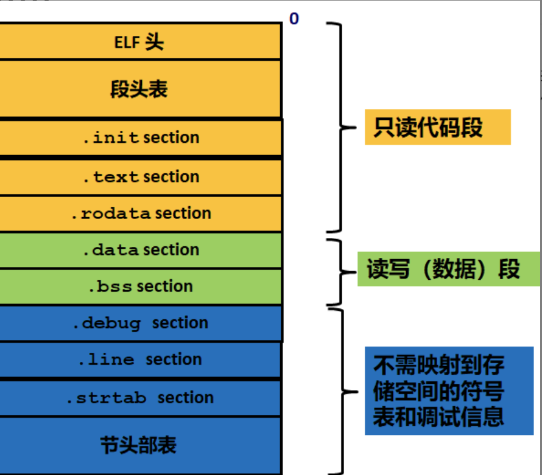
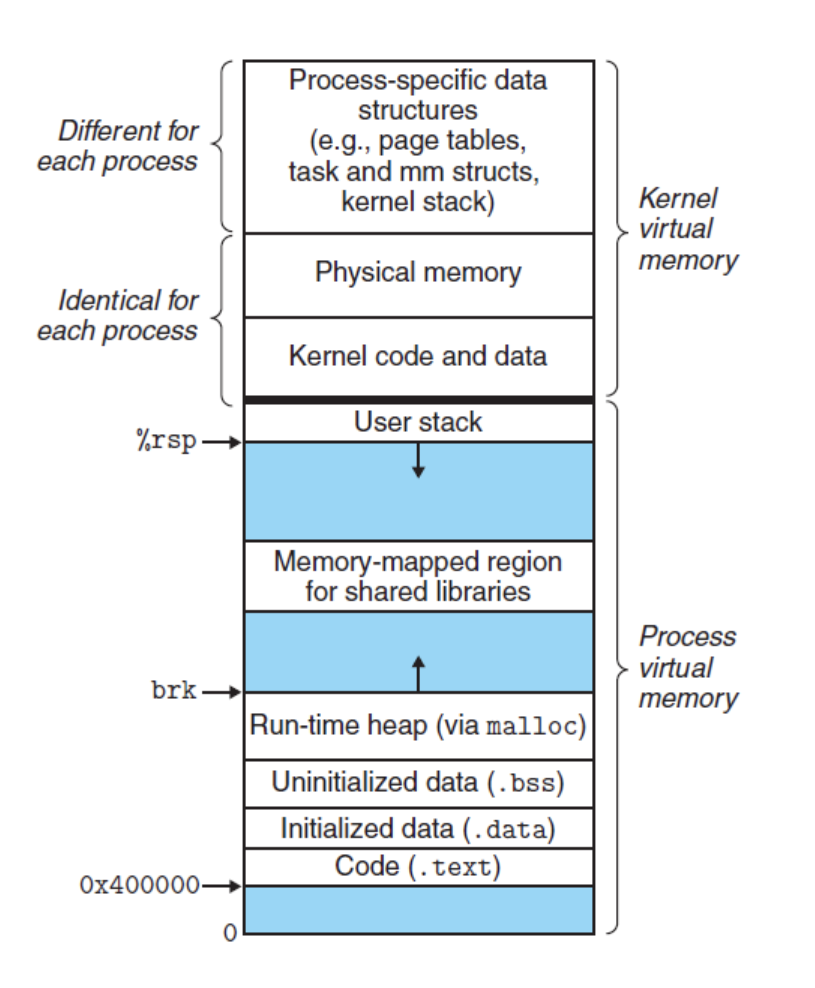

## ELF 文件:

可执行与可链接格式(Executable and Linkable Format)是一种用于可执行文件, 目标代码, 共享库和核心转储(core dump)的标准文件格式, 每个ELF文件都由一个ELF header 和紧跟其后的文件数据部分组成, 可以参考 ELF 文件的构成如下:



我们可以看见可执行程序内部都是分段进行存储的.

- `.text section`: 代码段, 通常存放已编译程序的机器代码, 一般操作系统加载后, 这部分是只读的
- `.rodata section`: 只读数据段, 此段的数据不可修改, 存放程序中会使用的常量
- `data section`: 数据段, 主要用于存放已初始化的全局变量, 常量
- `bss section`: 未初始化的全局标量, 仅是占位符, 不占据任何实际磁盘空间

> 目标文件格式区分初始化和非初始化是为了空间效率

操作系统在加载 `ELF` 文件时, 会按照文件结构, 依次读取每个 section 中的内容, 并将其加载到内存中, 同时为该进程分配空间, 并将 `pc寄存器` 指向代码段的起始位置, 然后启动进程

## 内存分区

C++ 程序在运行时, 会按照不同的功能划分不同的段: 栈, 堆, 全局/静态存储区, 常量存储区, 代码区

- 栈: 目前绝大多数CPU体系是基于栈来运行程序的, 栈中主要存放函数的局部变量, 函数参数, 返回地址等, 栈空间一般由操作系统进行默认分配或者程序指定分配, 栈空间在进程生存周期一直都存在, 当进程退出时, 操作系统才会对栈空间进行回收
- 堆: 动态申请的内存空间, 就是由 `malloc` 函数或者 `new` 函数分配的内存块, 由系统控制它的分配和释放, 可以在程序运行周期随时进行申请和释放, 如果进程结束后还没收释放, 操作系统会自动回收
- 全局区/静态存储区: 主要为 `.bss` 和 `.data` 段, 存放全局变量和静态变量, 程序运行结束, 操作系统自动释放, 在 `C` 中, 未初始化的放在 `.bss` 段中, 初始化的放在 `.data` 段中
- 常量存储区: `.rodata` 段, 存放常量, 不允许修改, 程序运行结束后自动释放
- 代码区: `.text` 段, 存放代码, 不允许修改, 但可以执行, 编译后的二进制文件存放在这里

参考 `Linux` 操作系统的内存分布如下: 

从操作系统的本身而言, 以上存储区在该程序内存中的虚拟地址分布是如下形式(虚拟地址从**低地址** 到 **高地址**, 实际的物理地址可能是随机的): text->.data->.bss->heap->unused->stack->...



### 程序实例

以下为详细的程序实例, 也可以通过 GDB 工具来查看具体的每个变量的存放地址

```cpp
#include <iostream>
using namespace std;

/*
* 说明: C++ 中不再区分初始化和未初始化的全局变量, 静态变量的存储区, 如果非要区分, 在下述程序标注在了括号中
*/

int g_var = 0; // g_var 在全局区(.data 段)
char * gp_var; // gp_var 在全局区(.bss 段)

int main()
{
    int var;    // var 在 栈区
    char * p_var;   // p_var 在栈区
    char arr[] = "abc"; // arr 为数组变量, 存储在栈区: "abc" 为字符串常量, 存储在常量区
    char *p_var1 = "12345"; // p_var1 在栈区: "123456" 为字符串常量, 存储在常量区
    static int s_var = 0; // s_var 为静态变量, 存在静态存储区(.data 段)
    p_var = (char*)malloc(10) // 分配得来的10个字节的区域在堆区
    free(p_var);
    return 0;
}
```
