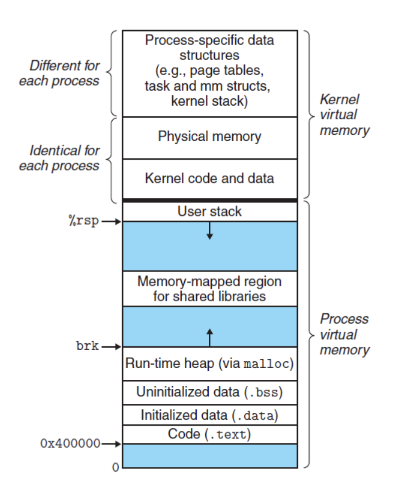

## 作用域 与 生命周期

这两个属性, 以 `空间`(作用域) 和 `时间`(生命周期) 两个不同的维度来描述一个 **变量**

### 作用域

一个变量可以被引用的范围

- **全局变量**: 全局变量只需在一个源文件中定义, 就可以作用域所有的源文件, 其他不包含全局变量定义的源文件需要用 `extern` 关键字再次声明这个全局变量
- **静态全局变量**: 与**全局变量**的区别在于如果程序包含多个文件的话, 它作用域定义它的文件里, 不能作用到其他文件里, 即被 `static` 关键字修饰过的变量具有文件作用域, *即使两个不同的文件都定义了相同的名字的静态全局变量, 它们也是不同的变量*
- **局部变量**: 它是自动对象(`auto`), 在程序运行期间不是一直存在,而是只在函数执行区间存在, 函数的依次调用执行结束后, 变量被撤销, 其所占的内存也被收回, 局部变量对于函数外部的程序说是不可见的, 实际是以 `{}` 为所用与
- **静态局部变量**: 它直被初始化依次, 自从第一次被初始化知道程序运行结束都一直存在, 它只对定义自己的函数体始终可见, 只有定义该变量的函数内部可以使用和访问该变量

### 生命周期

变量可以存在(被引用)的时间段

- **全局变量**: 在真个程序运行期间都会一直存在, 都可以随时访问, 当程序结束时, 对应的变量会自动销毁, 内存被系统回收
- **局部变量**: 仅限于函数被调用期间, 当函数调用结束时, 该变量会自动销毁
- **静态局部变量**: 在程序运行期间一直存在, 局部静态变量只能被初始化一次

### 从分配内存空间看

不同生命周期的变量, 在程序内存中的分布位置是不一样的, 内存分为 **代码区(.text)**, **全局数据区(.data, .bss, .rodata)**, **堆区(heap)**, **栈区(stack)**, 不同的内存区域, 对应不同的生命周期

- 静态变量一般存储在数据段, 包括 `data` 段. `bss` 段, `rodata` 段, 其中 `data` 存储已经初始化的静态变量和全局变量, `bss` 存储未初始化的静态变量与全局变量
- 局部变量一般存储在 **栈区** 或者 **堆区**

### Note

- 静态变量和栈变量(存储在栈中的变量), 堆变量(存储在堆中的变量)的区别: 静态变量会被放在程序的静态存储区(`.data` 段, `bss` 段, `rodata` 段)中(静态变量会自动初始化, 这样可以在下一次调用的时候还可以保持原来的赋值), 而栈变量或堆变量不能保证在下一次调用的时候依然保持原来的值
- 静态变量和全局变量的区别: 静态变量仅在变量的作用范围内可见, 实际是依靠编译器来操控作用域, 全局变量在整个程序范围内都可见, 只需要声明该全局变量, 即可使用
- 全局变量的定义不要再头文件中定义: 如果在头文件中定义全局变量, 当该头文件被多个文件 `#include` 时, 该头文件中的全局变量就会被多次定义, 编译时会应为重复定义而报错, 一般情况下我们将变量的定义放在 `.cpp` 文件中, 在 `.hpp` 文件使用 `extern` 对变量进行声明