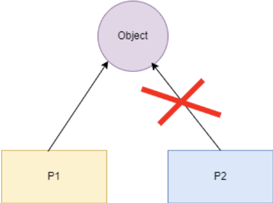

## 智能指针

为了解决**动态内存分配**时带来的内存泄露以及多次释放同一块内存空间而提出的

传统的指针在申请完成后, 必须要调用 free 或 delete 来释放指针, 否则容易产生内存泄漏的问题

smart pointer 遵循 RAII 原则, 当 smart pointer 对象创建时, 即为该指针分配了相应的内存, 当对象销毁时, 析构函数会自动释放内存, 需要注意的是, 智能指针不能像普通指针那样支持加减运算(迭代操作)

## 智能指针的类型

- **unique_ptr**: 独享所有权的智能指针, 资源智能被一个指针占有, 该指针不能拷贝构造和赋值, 但可以进行移动构造和移动赋值构造(调用 `move()` 函数), 即一个 `unique_ptr` 对象赋值给另一个 `unique_ptr` 对象, 可以通过该方法进行赋值

- **shared_ptr**: 与 `unique_ptr` 不同的是, `shared_ptr` 中的资源可以被多个指针共享, 但是多个指针指向同一个资源不能被释放多次, 因此使用计数机制表明资源被几个指针共享;
通过 `use_count()` 查看资源的所有者的个数, 可以通过 `unique_ptr`, `weak_ptr` 来构造, `release` 释放资源的所有权, 同时将计数减一, 当计数减为 0 时候,会自动释放内存空间, 从而避免了泄露
需要注意的是, `shared_ptr` 并不是线程安全的, 但 `shared_ptr` 的计数是原子操作实现的, 利用 `atmoic CAS` 指令实现
通过 `shared_ptr` 的内存模型, 当引用计数和 `weak cout` 同时为 0 时, `shared_ptr` 对象才会被最终释放掉
通过查看 shared_ptr 的源代码可以看到如下, `shared_ptr` 实际成员包含两个指针, 一个指向对象资源的指针 `ptr`, 另一个指向管理区域的指针 `___cntrl_`, 具体 `__cntrl_` 指针的区域包括 `deleter`, `allocator`, `shared_ptr` 对象的引用计数, `weak_ptrs` 的对象的引用计数

- **weak_ptr**: 指向 `shared_ptr` 指向的对象, 能够解决 `shared_ptr` 带来的循环引用的问题, 与 `shard_ptr` 配合使用, 将 `weak_ptr` 转换为 `shared_ptr` 时, 虽然它能访问 `shared_ptr` 所指向的资源, 但却不享有资源的所有权, 不影响该资源的引用计数, 有可能资源已经被释放, 但 `weak_ptr` 仍然存在, `shared_ptr` 必须等待所有引用 `weak_ptr` 全部被释放才会进行释放, 因此, 每次访问资源时, 都需要判断资源是否有效.

